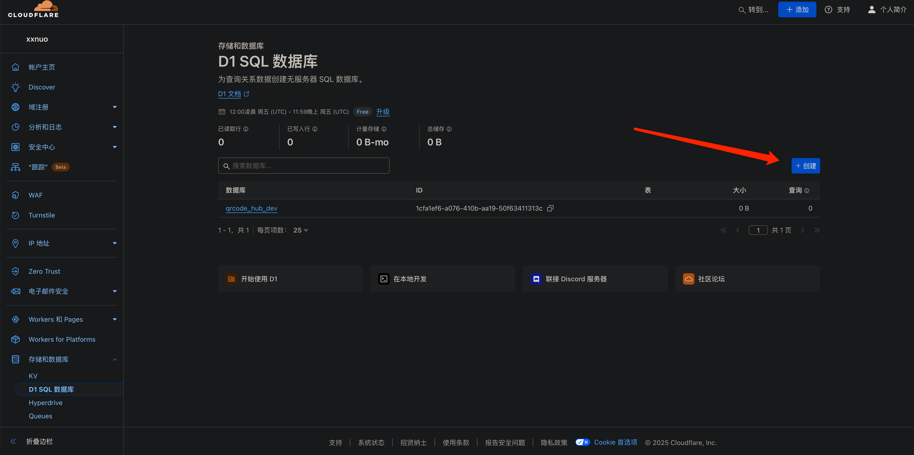
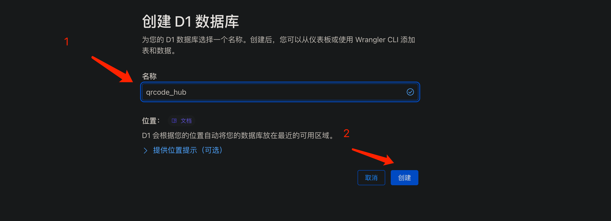
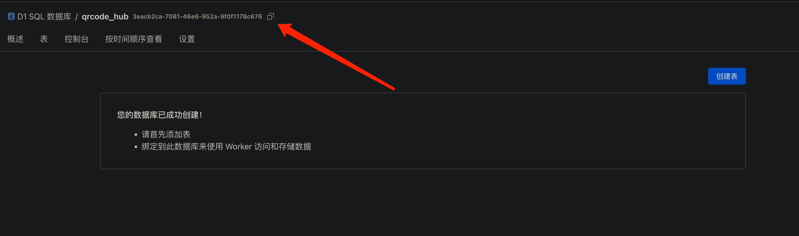
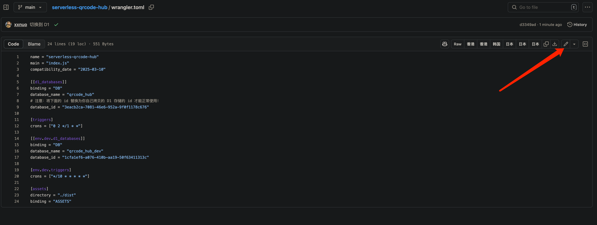
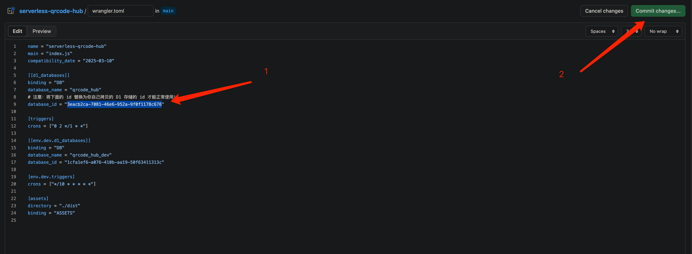
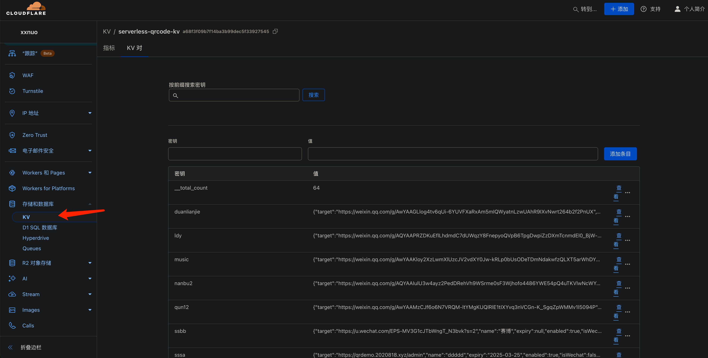

- 登录 Cloudflare 并创建 D1 SQL 数据库

   
   

- 复制 D1 SQL 数据库 ID

   

- 在 GitHub 你 Fork 的仓库点击 Sync 同步代码
- 在 GitHub 打开你 Fork 的仓库的 `wrangler.toml` 文件，点击图中的按钮编辑

   

- 将 `d1_databases` 下的 `database_id` 内容替换为你自己拷贝的 D1 SQL 数据库 ID

   

- 等待 Cloudflare 自动部署成功即可

- 原 KV 数据可以在这里看到，短链接项目复制粘贴手动在新版管理面板里添加即可，微信二维码建议重新添加一下，不支持自动迁移，太过麻烦。后续应该不会有这种大的改动了。

   