# serverless-qrcode-hub

苦于微信群聊二维码频繁变动，开发这个能生成永久二维码的工具，**不需要服务器**。基于 Cloudflare Workers 和 D1 实现。

> 旧版使用的 KV 的免费额度太少，新版本改为基于 D1 存储，500万次读取够用了，建议使用旧版的及时升级，基于 KV 的最后版本是 v1.2.0: [README.v1.md](./README.v1.md)（不建议再使用）
>
> 旧版 KV 迁移到新版的指南: [MIGRATE.md](./MIGRATE.md)

## 功能特性

- 🔗 生成永久短链接，指向微信群二维码
- 😋 可当短链接生成器
- ☁️ 无需服务器
- 🎨 自定义二维码样式和 Logo
- 💻 管理后台可随时更新
- 🔐 密码保护

<a href="https://qrdemo.2020818.xyz" target="_blank">Demo 地址</a>(密码: `demo`)

## 预览图

- 登录

  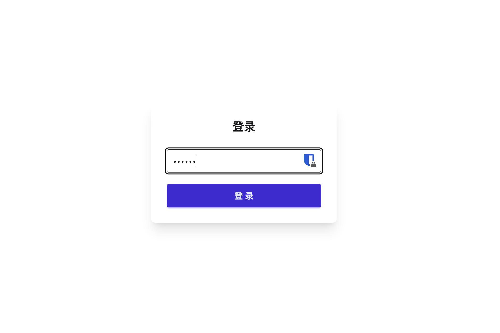

- 管理后台1：添加普通短链

  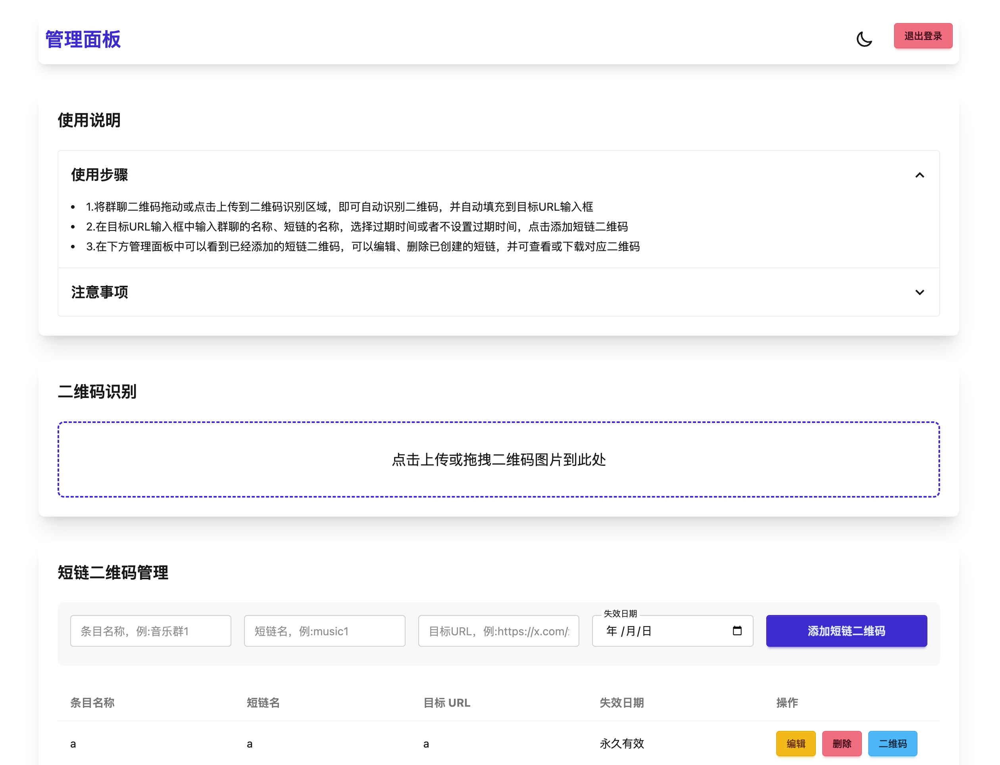

- 管理后台2：添加微信二维码

  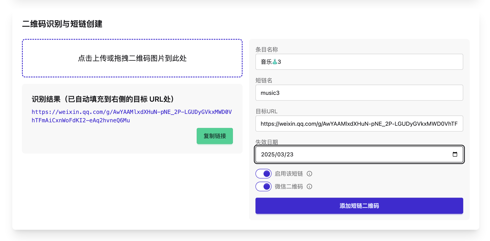

- 管理后台3

  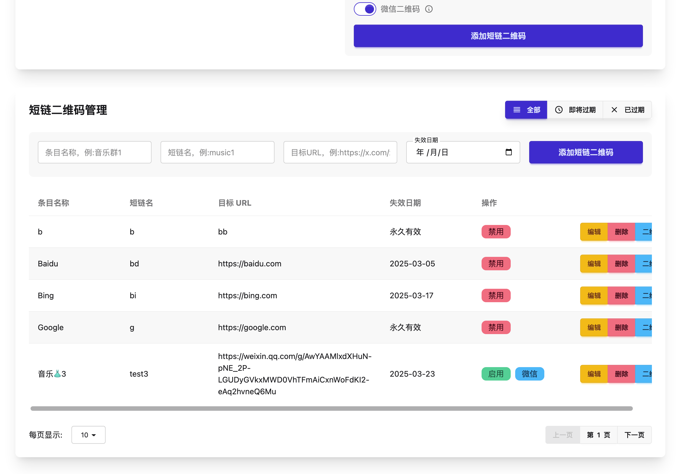

- 生成二维码

  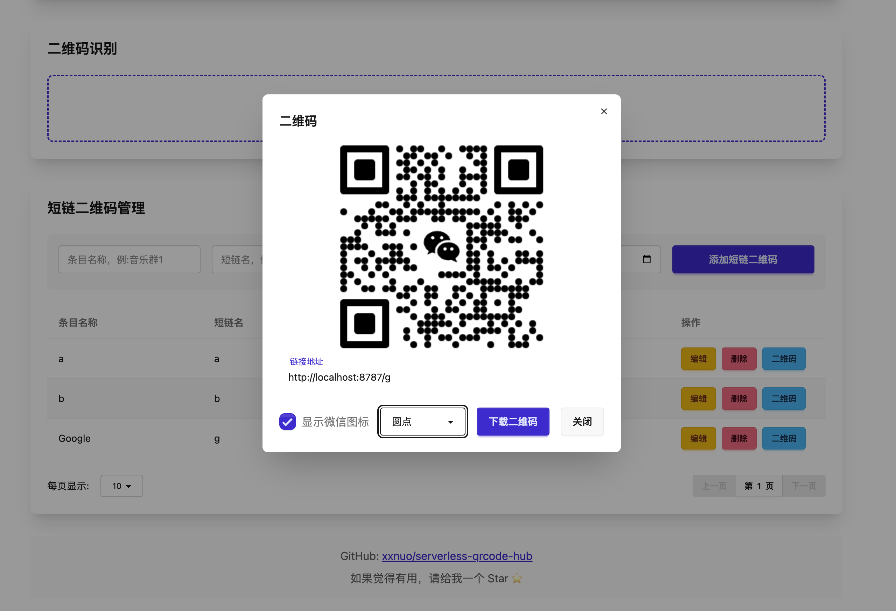

- 管理后台4：编辑

  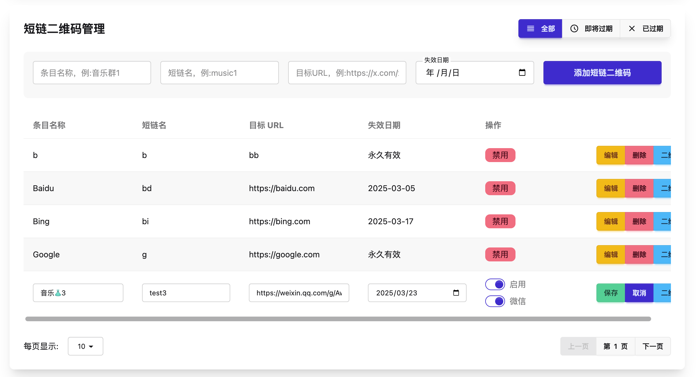

- 微信识别

  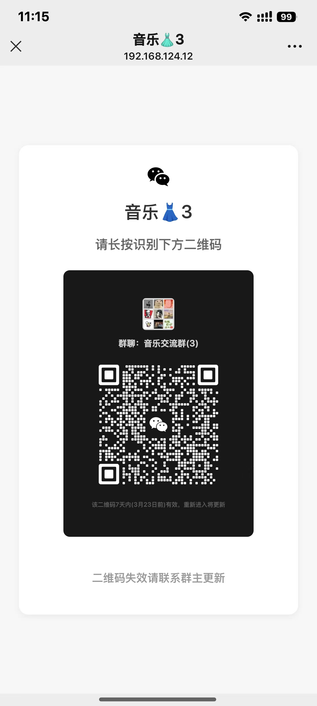
  
- 短链跳转就不展示了，是直接跳转的

## 使用步骤

1. 登录 Cloudflare 并创建 D1 SQL 数据库

   
   

2. 复制 D1 SQL 数据库 ID

   

3. 回到 GitHub 并 Fork 仓库

   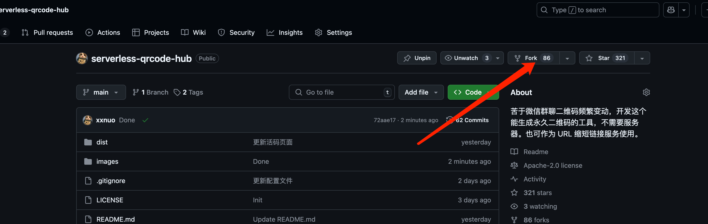

4. 在 GitHub 打开你 Fork 的仓库的 `wrangler.toml` 文件，点击图中的按钮编辑

   

5. 将 `d1_databases` 下的 `database_id` 内容替换为你自己拷贝的 D1 SQL 数据库 ID

   

6. 回到 Cloudflare 并创建 Worker

   

7. 选择你 Fork 的 Github 仓库，然后直接点击右下角的 `保存并部署`

   

8. 等待部署成功，自动跳转到了这个页面，此时默认分配的 `*.workers.dev` 域名在国内访问较慢，建议绑定自己的域名

   

9. 绑定自定义域名

   

10. 设置一个你在 Cloudflare 托管的域名的子域名 

   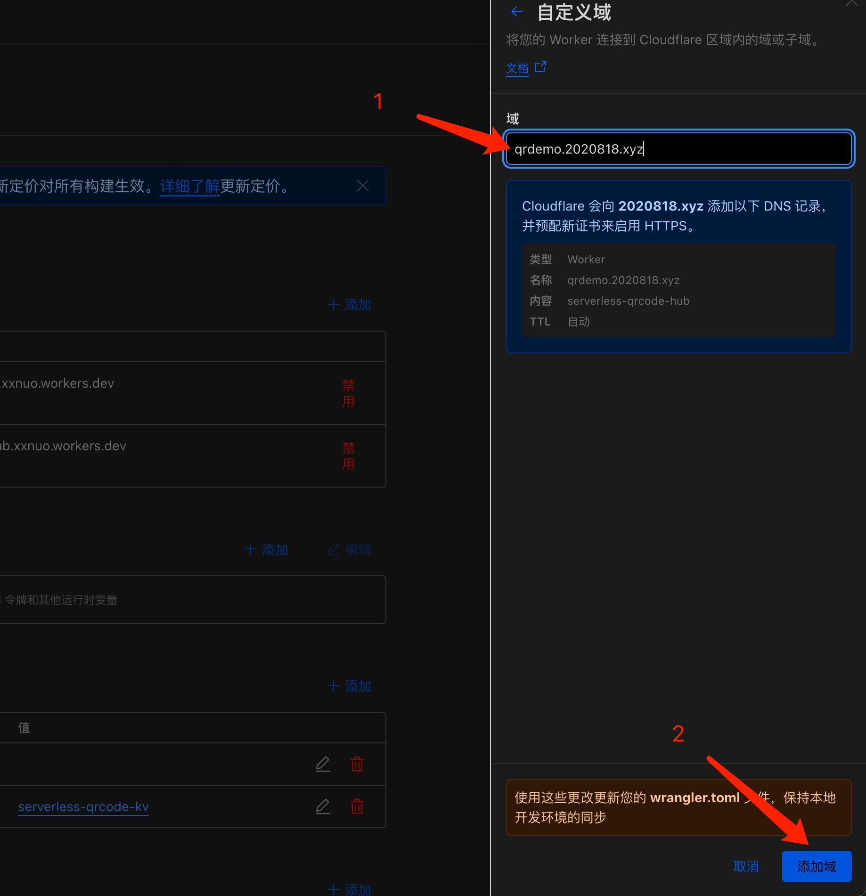

11. 按图中步骤设置访问密码，注意密码格式为英文字母和数字，尽量长尽量复杂，推荐使用两段随机生成的uuid字符串作为密码

   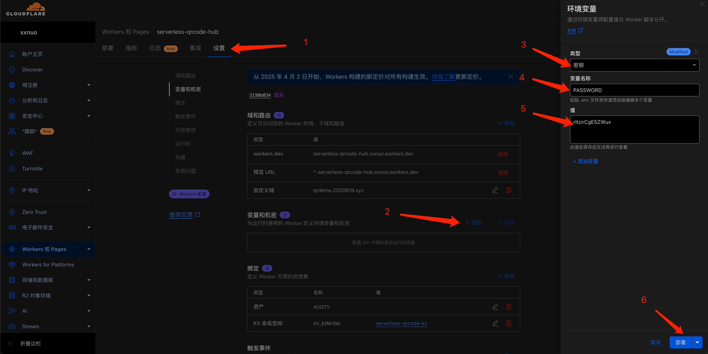

12. 部署成功，此时已经可以面板上通过默认分配的 `*.workers.dev` 或者你自定义的域名访问了！

13. 访问并登录后，创建短链接例子

   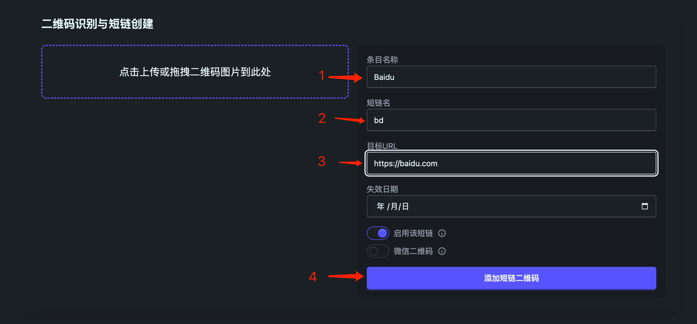
   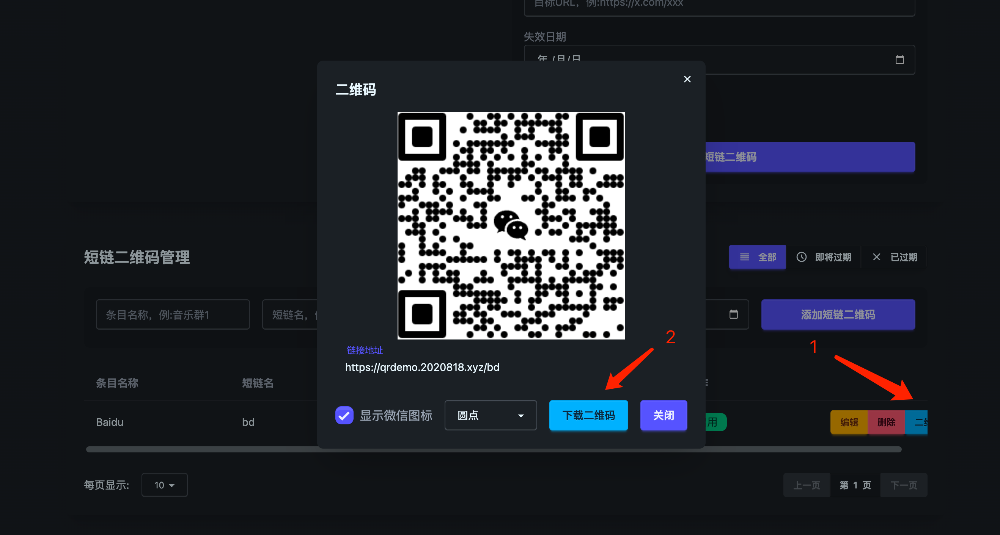

14. 创建微信群聊活码例子

   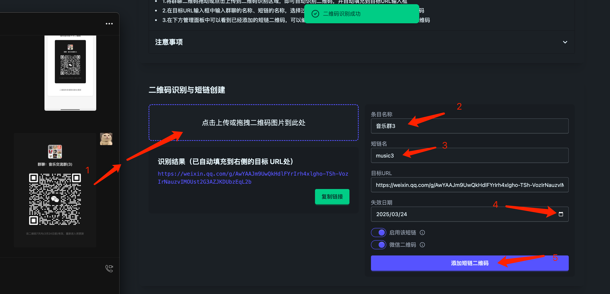
   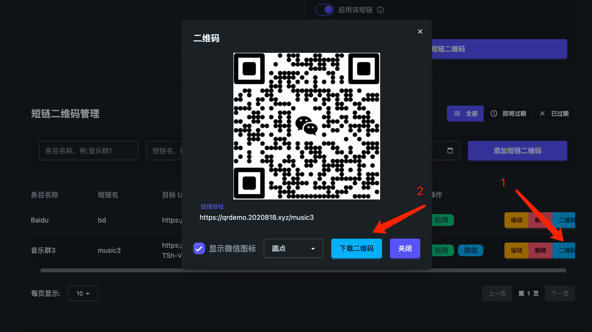

## TODO

- [ ] 实现定时检查过期短链功能
  - [x] 自动检查过期的短链接
  - [ ] 发送邮件通知管理员
  - [x] 自动清理过期数据
- [ ] 添加访问统计功能
- [ ] 支持批量导入导出
- [ ] 支持多租户
- [ ] 支持多语言
- [ ] 支持多 Serverless 平台
- [ ] 手机端快捷更新二维码功能

欢迎提交 Issue 和 Pull Request！
