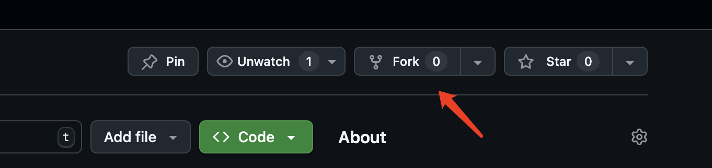
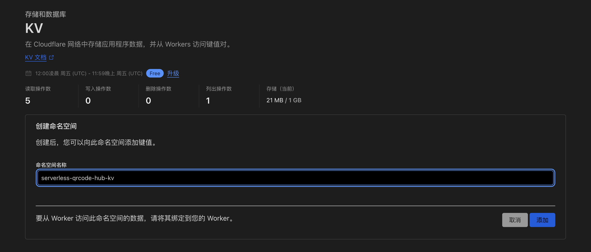
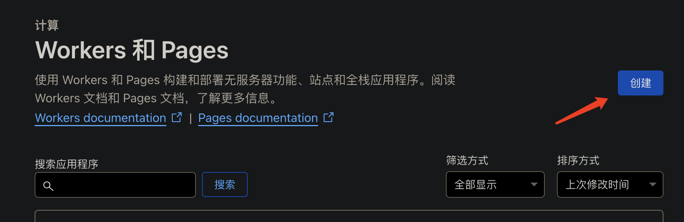
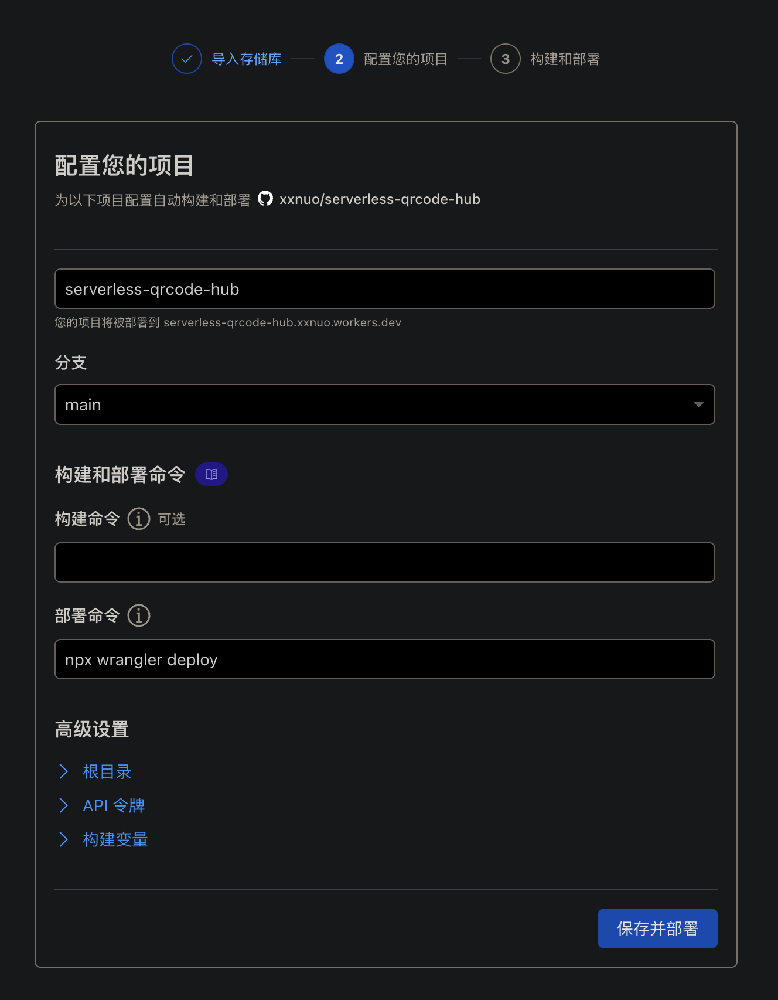
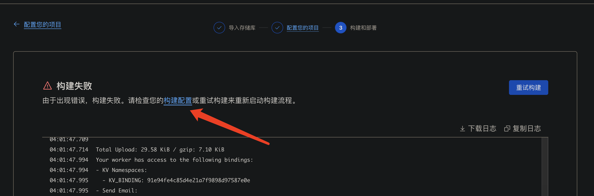
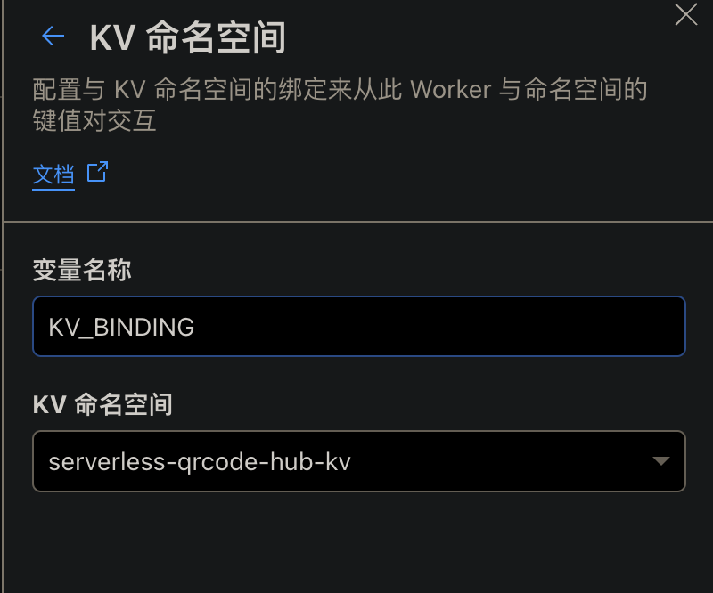
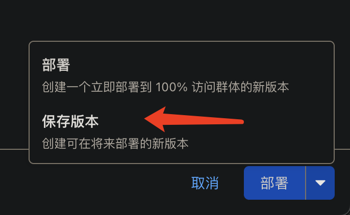
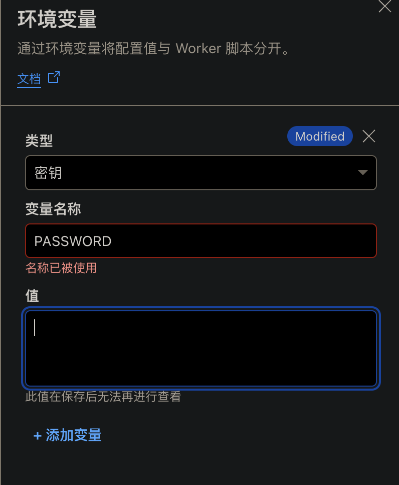
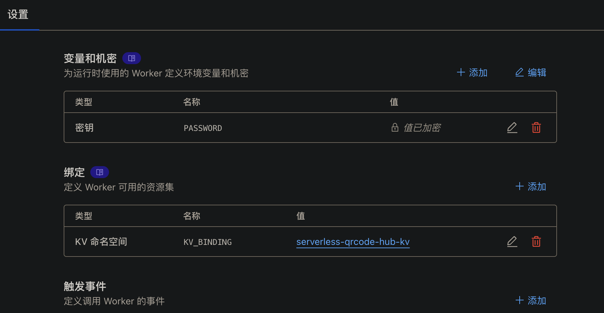
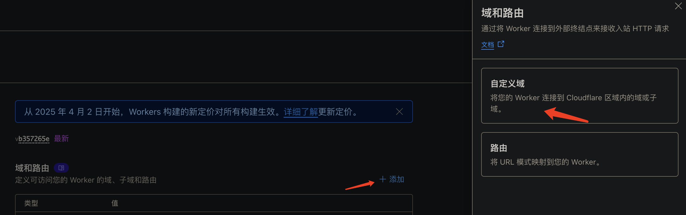

# serverless-qrcode-hub

苦于微信群聊二维码频繁变动，开发这个能生成永久二维码的工具，不需要服务器。基于 Cloudflare Workers 和 KV 存储实现。

## 功能特性

- 🔗 生成永久短链接，指向微信群二维码
- 🎨 自定义二维码样式和 Logo
- 💻 管理后台可随时更新
- 🔐 密码保护
- 😋 可当短链接生成器
- ☁️ 无需服务器

## 使用步骤

- Fork 仓库
- 创建 KV 命名空间
- 创建 Worker
- 绑定 KV 命名空间 KV_BINDING
- 创建环境变量 PASSWORD
- 绑定自定义域名

### 参考截图

**步骤不需要和我这个完全一致，只要能部署成功就行。我这里有一些错误，请忽略。**

1. Fork 本项目
   
2. 创建 KV 命名空间
   
3. 创建 Worker
   
4. 选择你 Fork 的项目
   
5. 修改构建配置
   
6. 绑定 KV 命名空间 KV_BINDING
   
7. 点击保存版本
   
8. 创建环境变量 PASSWORD，注意格式是英文大小写字母、数字或者符号，尽量搞复杂点
   
9. 点击保存版本
   
10. 最终效果
    
11. 回到部署页，点击 `您的上一次构建失败。查看构建` 然后点击 `重试构建`

12. 部署成功
13. 绑定自定义域名
    

## 贡献指南

- [ ] 实现定时检查过期短链功能
  - [x] 自动检查过期的短链接
  - [ ] 发送邮件通知管理员
  - [x] 自动清理过期数据
- [ ] 添加访问统计功能
- [ ] 支持批量导入导出
- [ ] 支持多租户
- [ ] 支持多语言
- [ ] 支持多 Serverless 平台

欢迎提交 Issue 和 Pull Request！
